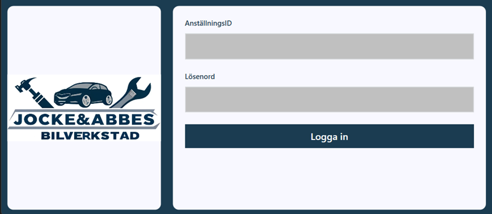
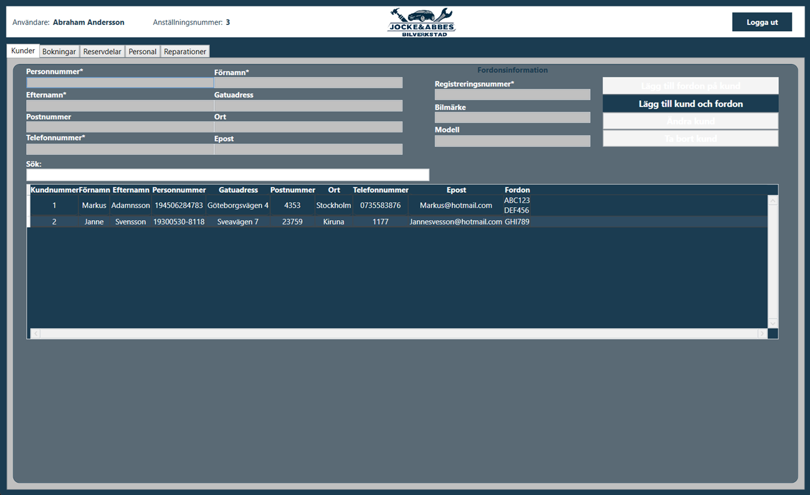
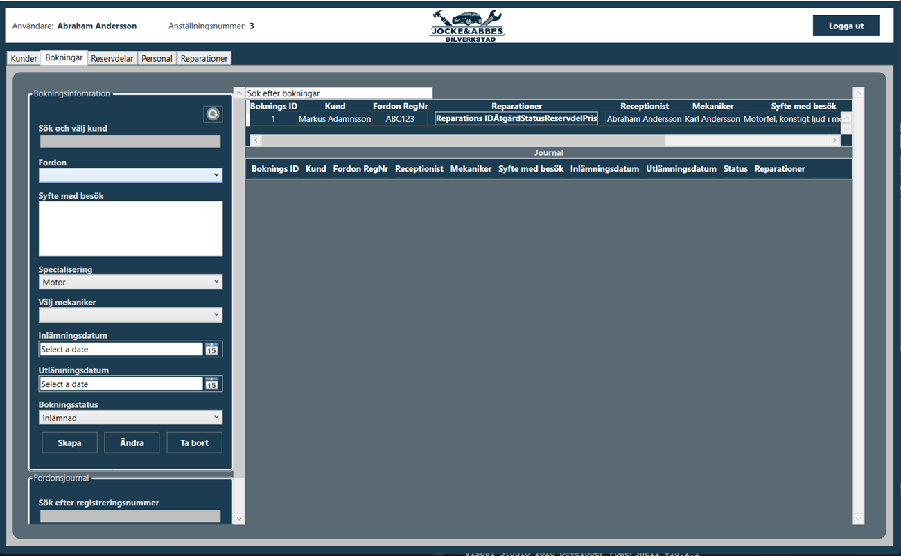
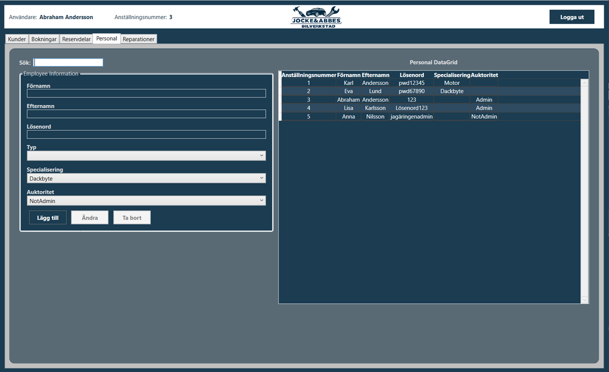
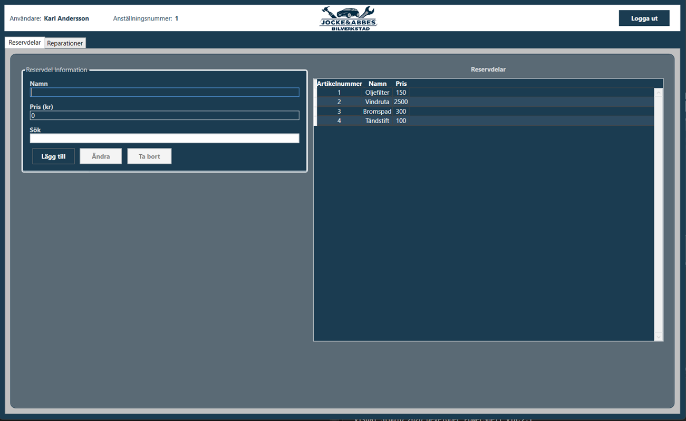
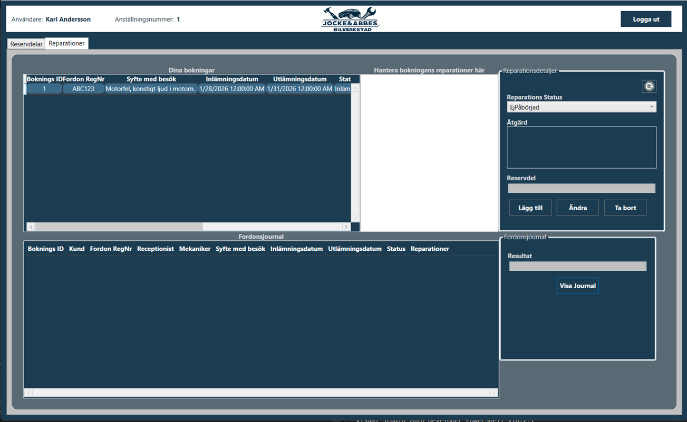
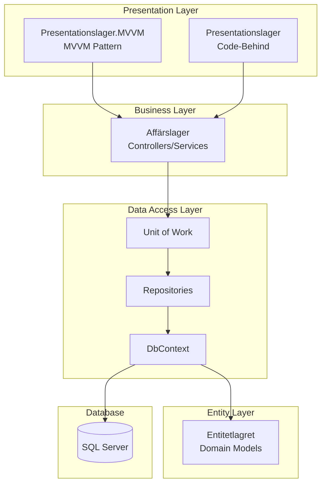
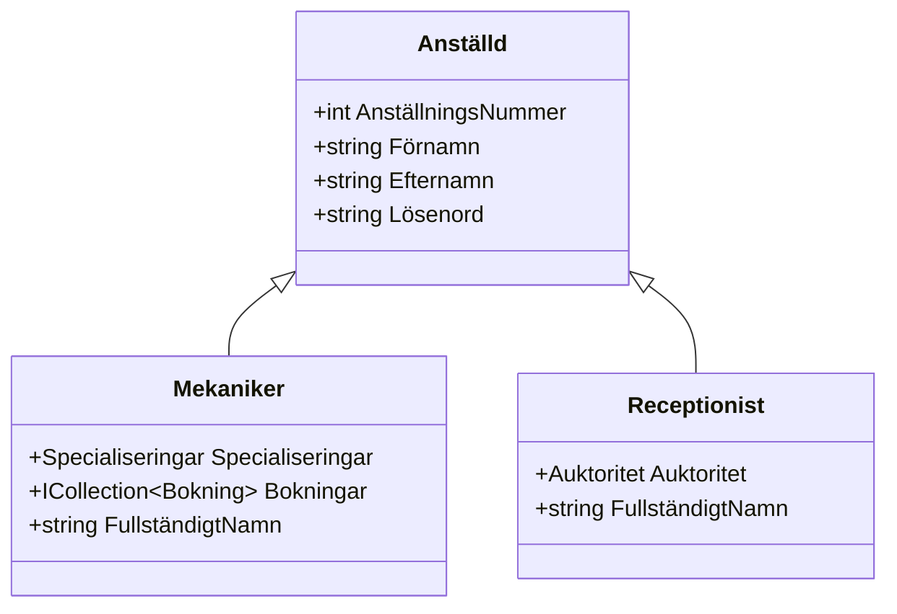
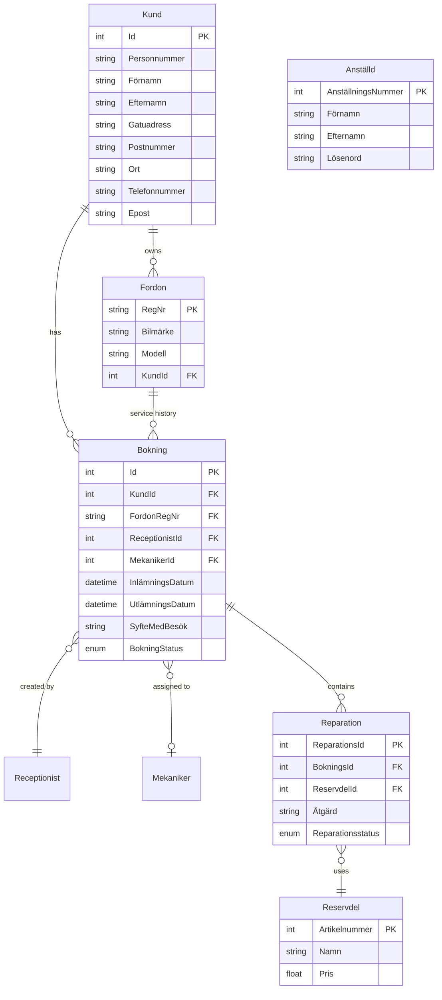

# 🚗 Bilverkstad - Car Workshop Management System


A comprehensive **Car Workshop Management System** built with .NET 8.0 and WPF, featuring a clean N-tier architecture, multiple design patterns, and role-based access control. This project was developed as part of the Object-Oriented Programming course (OOPC) at Högskolan i Borås during Spring 2024.

> **Note:** "Bilverkstad" is Swedish for "Car Workshop" - all domain terminology uses Swedish naming conventions.

---

## 📋 Table of Contents

- [Project Overview](#-project-overview)
- [Key Features](#-key-features)
- [Architecture](#-architecture)
- [Design Patterns](#-design-patterns)
- [Database Schema](#-database-schema)
- [Technologies Used](#-technologies-used)
- [Skills Demonstrated](#-skills-demonstrated)
- [Getting Started](#-getting-started)
- [Project Statistics](#-project-statistics)
- [Team & Contributions](#-team--contributions)

---

## 🎯 Project Overview

Bilverkstad is a full-featured desktop application designed to manage the daily operations of an automotive repair shop. The system handles the complete workflow from customer registration to repair completion, including:

- **Customer Management** - Register and maintain customer information with associated vehicles
- **Booking System** - Schedule appointments and assign mechanics based on specialization
- **Repair Tracking** - Document repairs, track status, and manage spare parts
- **Staff Management** - Handle employees with different roles (Receptionist, Mechanic, Admin)
- **Vehicle Journal** - Maintain complete service history for each vehicle

The application implements **two separate presentation layers** - one using traditional WPF code-behind and another using the **MVVM pattern** - demonstrating proficiency in both approaches and the evolution of architectural thinking.

---

## 📸 Screenshots

### Login Screen
Secure employee authentication with role-based access control.



### Customer Management (Kunder)
Full CRUD operations for customers with associated vehicles. Admin receptionists have full access to manage customer data.



### Booking Management (Bokningar)
Create and manage service bookings, assign mechanics by specialization, and track booking status. Includes vehicle service journal lookup.



### Staff Management (Personal)
Admin view for managing employees - receptionists and mechanics with their specializations and authority levels.



### Spare Parts Inventory (Reservdelar)
Manage spare parts catalog with article numbers and pricing. Available to mechanics and admin receptionists.



### Repair Management (Reparationer)
Mechanics can view their assigned bookings, manage repairs, track status, and access the complete vehicle service journal.



---

## ✨ Key Features

### Authentication & Authorization
- User login with employee credentials
- **Role-based access control** with three user types:
  - **Admin Receptionist** - Full system access
  - **Standard Receptionist** - Customer and booking management
  - **Mechanic** - View assigned bookings and manage repairs

### Customer & Vehicle Management
- Complete CRUD operations for customers
- One-to-many relationship between customers and vehicles
- Search functionality across multiple fields
- Input validation (Swedish personal number format, phone numbers, registration plates)

### Booking System
- Create, update, and delete bookings
- Assign mechanics based on specialization (Tire Change, Engine, Electronics, Body Work)
- Track booking status (Submitted, In Progress, Delivered, Cancelled)
- Date validation and scheduling

### Repair Management
- Link repairs to bookings
- Track repair status and progress
- Associate spare parts with repairs
- Complete vehicle service journal

### User Interface
- Modern WPF interface with custom styling
- Real-time search with auto-complete dropdowns
- Data grids with sorting and filtering
- Tab-based navigation with role-dependent visibility

---

## 🏗 Architecture

The application follows a **clean N-tier (layered) architecture** that separates concerns and promotes maintainability:



### Layer Responsibilities

| Layer | Swedish Name | Responsibility |
|-------|--------------|----------------|
| **Entity Layer** | Entitetlagret | Domain models with EF Core data annotations, entity relationships, and computed properties |
| **Data Layer** | Datalager | Database context, repositories implementing generic CRUD, Unit of Work pattern, migrations |
| **Business Layer** | Affärslager | Business logic controllers, validation, complex queries with eager loading, session management |
| **Presentation Layer** | Presentationslager | WPF views using code-behind approach |
| **MVVM Presentation** | Presentationslager.MVVM | WPF views using MVVM pattern with ViewModels, Commands, and Services |

### Project Structure

```
OOPC-VT24-Grupp-7/
├── Bilverkstad.Entitetlagret/          # Domain Entities
│   ├── Anställd.cs                     # Base Employee class
│   ├── Mekaniker.cs                    # Mechanic (inherits Anställd)
│   ├── Receptionist.cs                 # Receptionist (inherits Anställd)
│   ├── Kund.cs                         # Customer
│   ├── Fordon.cs                       # Vehicle
│   ├── Bokning.cs                      # Booking
│   ├── Reparation.cs                   # Repair
│   └── Reservdel.cs                    # Spare Part
│
├── Bilverkstad.Datalager/              # Data Access Layer
│   ├── BilverkstadContext.cs           # EF Core DbContext
│   ├── IUnitOfWork.cs                  # Unit of Work interface
│   ├── UnitOfWork.cs                   # Unit of Work implementation
│   ├── Migrations/                     # Database migrations
│   └── Repositories/
│       ├── BaseRepository/             # Generic repository
│       ├── Interfaces/                 # Repository interfaces
│       └── [Entity]Repository.cs       # Concrete repositories
│
├── Bilverkstad.Affärslager/            # Business Layer
│   ├── AnställdController.cs           # Employee management + authentication
│   ├── KundController.cs               # Customer management
│   ├── BokningsController.cs           # Booking management
│   ├── ReparationController.cs         # Repair management
│   ├── FordonController.cs             # Vehicle management
│   ├── ReservdelController.cs          # Spare parts management
│   └── AnvändarSession.cs              # User session state
│
├── Bilverkstad.Presentationslager/     # WPF (Code-Behind)
│   ├── LoginWindow.xaml                # Login screen
│   ├── MainWindow.xaml                 # Main navigation
│   └── [Feature]Window/                # Feature-specific windows
│
└── Bilverkstad.Presentationslager.MVVM/# WPF (MVVM Pattern)
    ├── ViewModels/                     # ViewModel classes
    ├── Views/
    │   ├── Windows/                    # Main windows
    │   ├── UserControls/               # Reusable controls
    │   └── Resources/                  # Styles and assets
    ├── Commands/                       # ICommand implementations
    ├── Services/                       # Window and message services
    ├── Models/                         # ObservableObject base
    └── Converters/                     # Value converters
```

---

## 🎨 Design Patterns

This project demonstrates proficiency in several enterprise design patterns:

### 1. Repository Pattern

Abstracts data access logic and provides a collection-like interface for domain entities.

```csharp
public interface IBaseRepository<T> where T : class, new()
{
    T Add(T entity);
    T Find(int id);
    IQueryable<T> GetAll();
    void Update(T entity);
    void Delete(int id);
    IEnumerable<T> Get(Expression<Func<T, bool>> filter = null,
                       Func<IQueryable<T>, IOrderedQueryable<T>> orderBy = null,
                       params Expression<Func<T, object>>[] includes);
}
```

### 2. Unit of Work Pattern

Coordinates the work of multiple repositories and ensures transactional consistency.

```csharp
public interface IUnitOfWork : IDisposable
{
    IKundRepository Kund { get; }
    IBokningRepository Bokning { get; }
    IMekanikerRepository Mekaniker { get; }
    // ... other repositories
    int SaveChanges();
}
```

### 3. MVVM (Model-View-ViewModel)

Separates UI logic from business logic, enabling testability and maintainability.

```csharp
public class KundHanteringViewModel : BaseViewModel
{
    private string _förnamn;
    public string Förnamn
    {
        get => _förnamn;
        set => SetProperty(ref _förnamn, value);  // Triggers PropertyChanged
    }
    
    public ICommand LäggTillKundCommand => new RelayCommand(() => {
        // Add customer logic
    });
}
```

### 4. Command Pattern

Encapsulates actions as objects for use with WPF data binding.

```csharp
public class RelayCommand : CommandBase
{
    private readonly Action _execute;
    private readonly Func<bool> _canExecute;
    
    public override void Execute(object? parameter) => _execute();
    public override bool CanExecute(object? parameter) => 
        _canExecute == null || _canExecute();
}
```

### 5. Observer Pattern (INotifyPropertyChanged)

Enables automatic UI updates when properties change.

```csharp
public abstract class ObservableObject : INotifyPropertyChanged
{
    public event PropertyChangedEventHandler? PropertyChanged;
    
    protected bool SetProperty<T>(ref T field, T value, 
        [CallerMemberName] string propertyName = null)
    {
        if (EqualityComparer<T>.Default.Equals(field, value)) return false;
        field = value;
        OnPropertyChanged(propertyName);
        return true;
    }
}
```

### 6. Inheritance & Polymorphism

Employee type hierarchy with specialized behavior.



### 7. Service Pattern

Abstracts cross-cutting concerns like window management.

```csharp
public interface IWindowService
{
    void OpenWindow(string windowName);
    void CloseWindow(string windowName);
}
```

---

## 🗄 Database Schema



### Key Relationships

- **Customer ↔ Vehicle**: One customer can own multiple vehicles
- **Booking**: Links a customer, vehicle, receptionist, and optionally a mechanic
- **Repair ↔ Spare Part**: Each repair can use a spare part from inventory
- **Employee Hierarchy**: TPH (Table Per Hierarchy) inheritance mapping for Mekaniker and Receptionist

---

## 🛠 Technologies Used

### Core Technologies
| Technology | Version | Purpose |
|------------|---------|---------|
| .NET | 8.0 | Runtime and SDK |
| C# | 12 | Primary programming language |
| WPF | .NET 8 | Desktop UI framework |
| Entity Framework Core | 8.0.4 | ORM and database migrations |
| SQL Server | - | Relational database |

### Libraries & Packages
| Package | Purpose |
|---------|---------|
| Microsoft.EntityFrameworkCore.SqlServer | SQL Server database provider |
| Microsoft.EntityFrameworkCore.Tools | Migration tooling |
| Extended.Wpf.Toolkit | Enhanced WPF controls (DateTimePicker) |
| Microsoft.Extensions.DependencyInjection | DI container |

### Development Tools
- **Visual Studio 2022** - IDE
- **Git & GitHub** - Version control with pull request workflow
- **SQL Server Management Studio** - Database management

---

## 💡 Skills Demonstrated

### Technical Skills

**Object-Oriented Programming**
- Class design with proper encapsulation
- Inheritance hierarchies (Anställd → Mekaniker/Receptionist)
- Polymorphism for role-based behavior
- Interface-based abstractions

**Software Architecture**
- N-tier/layered architecture design
- Separation of concerns
- Dependency management between layers
- Clean code organization

**Design Patterns**
- Repository Pattern for data access abstraction
- Unit of Work for transaction management
- MVVM for UI separation
- Command Pattern for action encapsulation
- Observer Pattern for reactive updates

**Database Development**
- Entity Framework Core Code-First approach
- Fluent API configuration for relationships
- Database migrations
- Complex LINQ queries with eager loading

**WPF Development**
- XAML markup and styling
- Data binding (OneWay, TwoWay)
- Custom UserControls
- Resource dictionaries
- Value converters

### Soft Skills

**Team Collaboration**
- Collaborative development with 3 team members
- Pull request workflow (272+ PRs)
- Code review practices
- Git branching strategies

**Project Management**
- 6-week development timeline
- Feature-based task distribution
- Iterative development approach

---

## 🚀 Getting Started

### Prerequisites

- [.NET 8.0 SDK](https://dotnet.microsoft.com/download/dotnet/8.0)
- [Visual Studio 2022](https://visualstudio.microsoft.com/) (with .NET Desktop workload)
- [SQL Server](https://www.microsoft.com/sql-server) (LocalDB or full instance)

### Installation

1. **Clone the repository**
   ```bash
   git clone https://github.com/Abdriano95/OOPC-VT24-Grupp-7.git
   cd OOPC-VT24-Grupp-7
   ```

2. **Update the connection string**
   
   Edit `Bilverkstad.Datalager/BilverkstadContext.cs` and update the connection string:
   ```csharp
   optionsBuilder.UseSqlServer(@"Server=(localdb)\MSSQLLocalDB;Database=Bilverkstad;Trusted_Connection=True;");
   ```

3. **Apply database migrations**
   ```bash
   cd Bilverkstad.Datalager
   dotnet ef database update
   ```

4. **Run the application**
   
   Open `OOPC-VT24-Grupp-7.sln` in Visual Studio and set either presentation project as startup:
   - `Bilverkstad.Presentationslager` - Traditional WPF
   - `Bilverkstad.Presentationslager.MVVM` - MVVM Pattern (recommended)

5. **Login credentials** (from seed data)
   - Admin: Employee ID `1`, Password: `123`
   - Mechanic: Employee ID `2`, Password: `pwd12345`

---

## 📊 Project Statistics

| Metric | Value |
|--------|-------|
| **Total Lines of Code** | ~10,000 |
| **C# Code** | ~7,250 lines |
| **XAML Markup** | ~2,700 lines |
| **Total Commits** | 488 |
| **Pull Requests** | 272+ |
| **C# Files** | 120+ |
| **Development Period** | April 9 - May 17, 2024 |
| **Duration** | ~6 weeks |

---

## 👥 Team & Contributions

This project was developed as a group assignment for the Object-Oriented Programming course (OOPC) at Högskolan i Borås, Spring 2024.

| Contributor | Focus Areas |
|-------------|-------------|
| **Abdriano** |  | Initital setup, Entity models, Architecture, MVVM implementation, Business logic |
| **joakimolssonn** | 231 | Initital setup, Entity Models, Features, Code reviews, Error handling, Business logic, Security |

---

## 📄 License

This project is licensed under the MIT License - see the [LICENSE.txt](LICENSE.txt) file for details.

---

## 🙏 Acknowledgments

- **Högskolan i Borås** - University course framework
- **Course Instructors** - Guidance on OOP principles and patterns
- **Microsoft Documentation** - WPF and EF Core references

---

<div align="center">

**Built with ❤️ as a first-year university project**

*Demonstrating enterprise-level architecture and design patterns*

</div>
